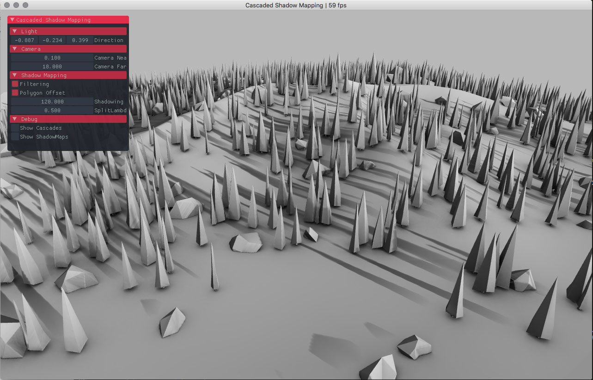
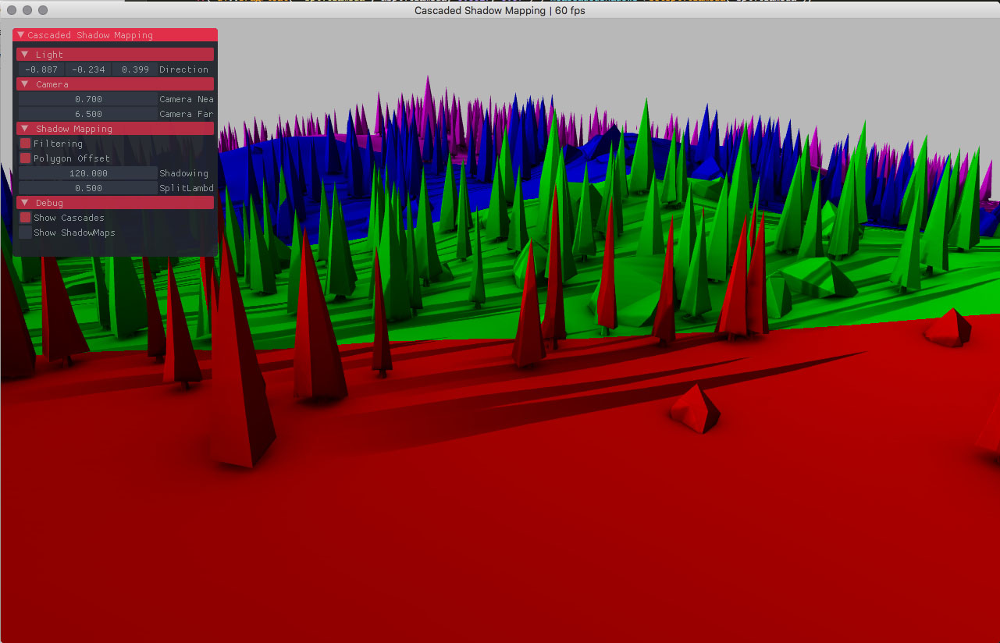

#### [Cascaded Shadow Mapping](src/CascadedShadowMappingApp.cpp)
Cascaded Shadow Mapping is a common method to get high resolution shadows near the viewer. This sample shows the very basic way of using this technique by splitting the frustum into different shadow maps. CSM has its own issues but usually provides better shadow resolution near the viewer and lower resolutions far away. The sample uses ESM for the shadowing algorithm (see the [ESM sample](/ExponentialShadowMap) for more infos about ESM).  

One easy improvement to this sample is to use the approach shown in the [GpuParrallelReduction sample](/GpuParrallelReduction) to find the minimum and maximum depth of the scene and use those values to better fit what the viewer see from the scene. Other approaches involve, better frustum culling, better splitting scheme or more stable samples distributions.

Some references :  
https://mynameismjp.wordpress.com/2013/09/10/shadow-maps/
http://http.developer.nvidia.com/GPUGems3/gpugems3_ch10.html
https://software.intel.com/en-us/articles/sample-distribution-shadow-maps
http://blogs.aerys.in/jeanmarc-leroux/2015/01/21/exponential-cascaded-shadow-mapping-with-webgl/
https://github.com/NVIDIAGameWorks/OpenGLSamples/blob/master/samples/gl4-maxwell/CascadedShadowMapping/CascadedShadowMappingRenderer.cpp  

##### License
Copyright (c) 2015, Simon Geilfus - All rights reserved.
This code is intended for use with the Cinder C++ library: http://libcinder.org

Redistribution and use in source and binary forms, with or without modification, are permitted provided that
the following conditions are met:

* Redistributions of source code must retain the above copyright notice, this list of conditions and
the following disclaimer.
* Redistributions in binary form must reproduce the above copyright notice, this list of conditions and
the following disclaimer in the documentation and/or other materials provided with the distribution.

THIS SOFTWARE IS PROVIDED BY THE COPYRIGHT HOLDERS AND CONTRIBUTORS "AS IS" AND ANY EXPRESS OR IMPLIED
WARRANTIES, INCLUDING, BUT NOT LIMITED TO, THE IMPLIED WARRANTIES OF MERCHANTABILITY AND FITNESS FOR A
PARTICULAR PURPOSE ARE DISCLAIMED. IN NO EVENT SHALL THE COPYRIGHT HOLDER OR CONTRIBUTORS BE LIABLE FOR
ANY DIRECT, INDIRECT, INCIDENTAL, SPECIAL, EXEMPLARY, OR CONSEQUENTIAL DAMAGES (INCLUDING, BUT NOT LIMITED
TO, PROCUREMENT OF SUBSTITUTE GOODS OR SERVICES; LOSS OF USE, DATA, OR PROFITS; OR BUSINESS INTERRUPTION)
HOWEVER CAUSED AND ON ANY THEORY OF LIABILITY, WHETHER IN CONTRACT, STRICT LIABILITY, OR TORT (INCLUDING
NEGLIGENCE OR OTHERWISE) ARISING IN ANY WAY OUT OF THE USE OF THIS SOFTWARE, EVEN IF ADVISED OF THE
POSSIBILITY OF SUCH DAMAGE.
