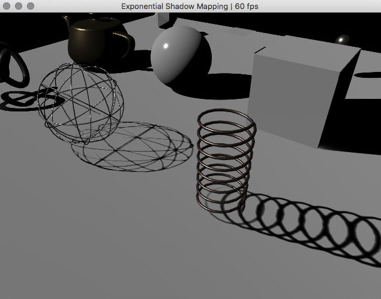

#### [Exponential Shadow Mapping](src/ExponentialShadowMapApp.cpp)  
Shadow Mapping is a vast subject and every approach comes with their own downsides. Basic shadow mapping have precision, aliasing,shadow acne and peter-panning issues, variance shadow mapping improves this but introduces light bleeding, etc... Exponential shadow mapping is an easy and inexpensive way to get rid of most of the above, but it (of course) comes with its own issues as well. The nice thing is that the shadow map can be inexpensively filtered in screenspace to produce softer shadows. On the other hand the main issue with ESM is that the closer a shadow is to the caster the brighter the shadow will be. Which may look weird in some cases. This is more or less fixed by using an "over-darkening" value but it doesn't work all the time.  

A few interesting links :  
http://advancedgraphics.marries.nl/presentationslides/13_exponential_shadow_maps.pdf
http://www.sunandblackcat.com/tipFullView.php?l=eng&topicid=35
http://nolimitsdesigns.com/tag/exponential-shadow-map/
http://web4.cs.ucl.ac.uk/staff/j.kautz/publications/esm_gi08.pdf
https://pixelstoomany.wordpress.com/2008/06/12/a-conceptually-simpler-way-to-derive-exponential-shadow-maps-sample-code/
http://www.olhovsky.com/2011/07/exponential-shadow-map-mFiltering-in-hlsl/

##### License
Copyright (c) 2015, Simon Geilfus - All rights reserved.
This code is intended for use with the Cinder C++ library: http://libcinder.org

Redistribution and use in source and binary forms, with or without modification, are permitted provided that
the following conditions are met:

* Redistributions of source code must retain the above copyright notice, this list of conditions and
the following disclaimer.
* Redistributions in binary form must reproduce the above copyright notice, this list of conditions and
the following disclaimer in the documentation and/or other materials provided with the distribution.

THIS SOFTWARE IS PROVIDED BY THE COPYRIGHT HOLDERS AND CONTRIBUTORS "AS IS" AND ANY EXPRESS OR IMPLIED
WARRANTIES, INCLUDING, BUT NOT LIMITED TO, THE IMPLIED WARRANTIES OF MERCHANTABILITY AND FITNESS FOR A
PARTICULAR PURPOSE ARE DISCLAIMED. IN NO EVENT SHALL THE COPYRIGHT HOLDER OR CONTRIBUTORS BE LIABLE FOR
ANY DIRECT, INDIRECT, INCIDENTAL, SPECIAL, EXEMPLARY, OR CONSEQUENTIAL DAMAGES (INCLUDING, BUT NOT LIMITED
TO, PROCUREMENT OF SUBSTITUTE GOODS OR SERVICES; LOSS OF USE, DATA, OR PROFITS; OR BUSINESS INTERRUPTION)
HOWEVER CAUSED AND ON ANY THEORY OF LIABILITY, WHETHER IN CONTRACT, STRICT LIABILITY, OR TORT (INCLUDING
NEGLIGENCE OR OTHERWISE) ARISING IN ANY WAY OUT OF THE USE OF THIS SOFTWARE, EVEN IF ADVISED OF THE
POSSIBILITY OF SUCH DAMAGE.
