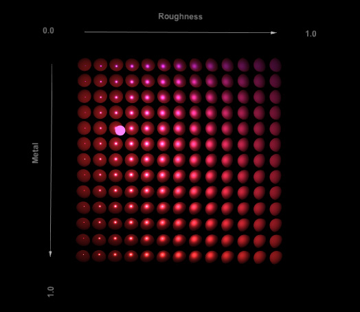
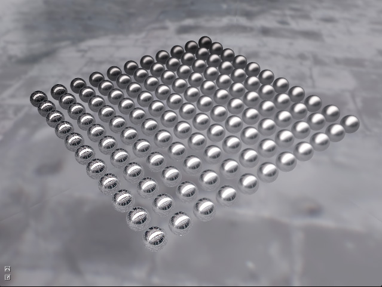
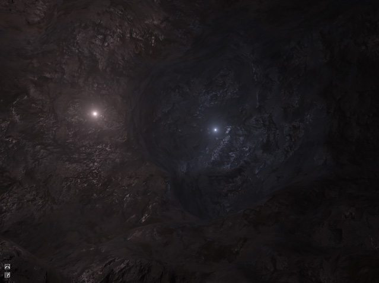
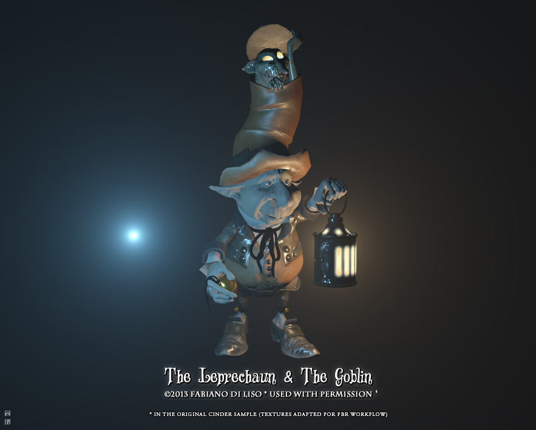
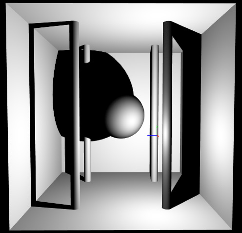
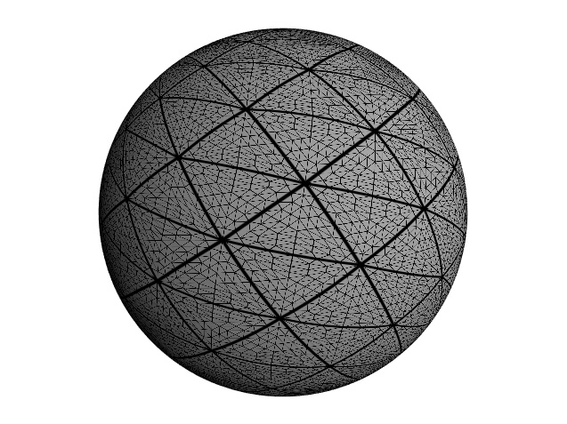
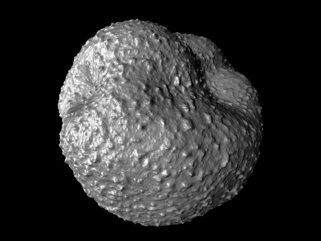
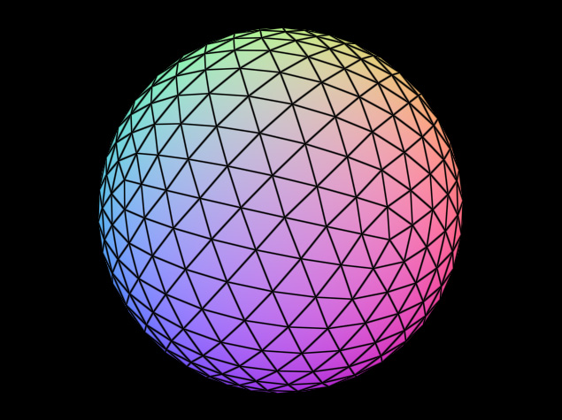

## Cinder Experiments

Samples and experiments built against the [glNext branch](https://github.com/cinder/Cinder/tree/glNext) of [cinder](http://libcinder.org/). This is just me trying out the new features of this upcoming cinder version.

The projects have only been tested on osx with Xcode 6. Project files are provided for visual studio 2012 and 2013. It is probably working on windows but not tested. Also shaders have only been tested with an ATI gpu, so it might not work on Nvidia or intel cards.

If you find any issue please let me know.

#### Samples:

##### [Physically Based Shading: Basics](/PBR Basic/)

This sample show the basics of a physically based shading workflow. Mainly adapted from disney and epic papers on the subject. The sample also show basics of tone mapping.

  

##### [Physically Based Shading: Image Based Lighting](/PBR Image Based Lighting/)

Image Based Lighting Specular reflections. Full approximation as described in Epic Unreal Engine 4 papers.

  

##### [Physically Based Shading: Texturing](/PBR Texturing/)

Alost the same code as the PBR Basics sample adding the basics of texturing and light scattering.  

  
   

##### [Physically Based Shading: Texturing 2](/PBR Texturing 2/)

Basically the same as cinder/glNext/Samples/_opengl/NormalMapping but adapted for PBR. The assets are of course subject to the same copyrights as the one distributed with cinder.

  
   

##### [Point Light Shadow Mapping](/PointLightShadows/)

Basic point light shadow mapping using a cubemap framebuffer object.  

  
   

##### [Tesselation Shader](/TessellationShader/)

!This sample was made before Andrew pushed the official tesselation shader implementation. I still have to update it to use the new API.

  
   

##### [Tesselated Noise](/TessellatedNoise/)

!This sample was made before Andrew pushed the official tesselation shader implementation. I still have to update it to use the new API.

  
   

##### [Wireframe Geometry Shader](/WireframeGeometryShader/)

Basic geometry and fragment shader for solid wireframe rendering.

  

#### License
 Copyright (c) 2014, Simon Geilfus - All rights reserved.
 
 Everyone is permitted to copy and distribute verbatim or modified 
 copies of this license document, and changing it is allowed as long 
 as the name is changed. 
 
THIS SOFTWARE IS PROVIDED BY THE COPYRIGHT HOLDERS AND CONTRIBUTORS "AS IS" AND ANY EXPRESS OR IMPLIED WARRANTIES, INCLUDING, BUT NOT LIMITED TO, THE IMPLIED WARRANTIES OF MERCHANTABILITY AND FITNESS FOR A PARTICULAR PURPOSE ARE DISCLAIMED. IN NO EVENT SHALL THE COPYRIGHT HOLDER OR CONTRIBUTORS BE LIABLE FOR ANY DIRECT, INDIRECT, INCIDENTAL, SPECIAL, EXEMPLARY, OR CONSEQUENTIAL DAMAGES (INCLUDING, BUT NOT LIMITED TO, PROCUREMENT OF SUBSTITUTE GOODS OR SERVICES; LOSS OF USE, DATA, OR PROFITS; OR BUSINESS INTERRUPTION) HOWEVER CAUSED AND ON ANY THEORY OF LIABILITY, WHETHER IN CONTRACT, STRICT LIABILITY, OR TORT (INCLUDING NEGLIGENCE OR OTHERWISE) ARISING IN ANY WAY OUT OF THE USE OF THIS SOFTWARE, EVEN IF ADVISED OF THE POSSIBILITY OF SUCH DAMAGE.