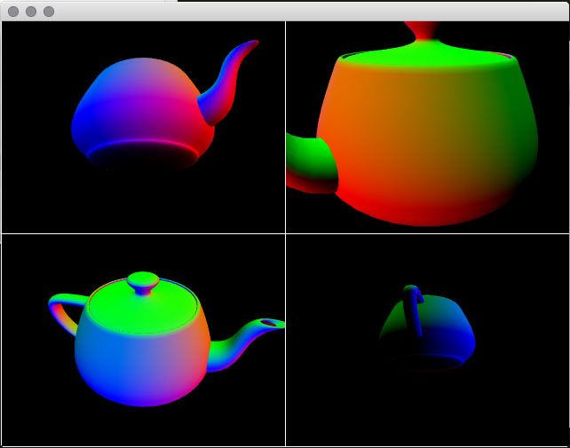

#### [Viewport Array](src/ViewportArrayApp.cpp)
Small sample showing the use of ```glViewportArrayv``` and ```gl_ViewportIndex``` to render to multiple viewports. ```glViewportArrayv``` is a nice way to specifies a list of viewports that can be later used in the geometry shader. By setting gl_ViewportIndex in the geometry shader you can re-direct your drawing calls to a specific viewport. Used along arrays of projections and view matrices it really ease the setup of a multiple viewport / 3d editor like view.  




##### License
Copyright (c) 2015, Simon Geilfus - All rights reserved.
This code is intended for use with the Cinder C++ library: http://libcinder.org

Redistribution and use in source and binary forms, with or without modification, are permitted provided that
the following conditions are met:

* Redistributions of source code must retain the above copyright notice, this list of conditions and
the following disclaimer.
* Redistributions in binary form must reproduce the above copyright notice, this list of conditions and
the following disclaimer in the documentation and/or other materials provided with the distribution.

THIS SOFTWARE IS PROVIDED BY THE COPYRIGHT HOLDERS AND CONTRIBUTORS "AS IS" AND ANY EXPRESS OR IMPLIED
WARRANTIES, INCLUDING, BUT NOT LIMITED TO, THE IMPLIED WARRANTIES OF MERCHANTABILITY AND FITNESS FOR A
PARTICULAR PURPOSE ARE DISCLAIMED. IN NO EVENT SHALL THE COPYRIGHT HOLDER OR CONTRIBUTORS BE LIABLE FOR
ANY DIRECT, INDIRECT, INCIDENTAL, SPECIAL, EXEMPLARY, OR CONSEQUENTIAL DAMAGES (INCLUDING, BUT NOT LIMITED
TO, PROCUREMENT OF SUBSTITUTE GOODS OR SERVICES; LOSS OF USE, DATA, OR PROFITS; OR BUSINESS INTERRUPTION)
HOWEVER CAUSED AND ON ANY THEORY OF LIABILITY, WHETHER IN CONTRACT, STRICT LIABILITY, OR TORT (INCLUDING
NEGLIGENCE OR OTHERWISE) ARISING IN ANY WAY OUT OF THE USE OF THIS SOFTWARE, EVEN IF ADVISED OF THE
POSSIBILITY OF SUCH DAMAGE.
